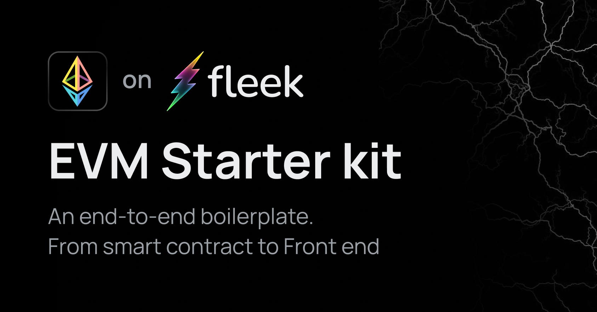

# Ethereum + Fleek Starter Kit



> Find a deep-dive guide on this [article](https://blog.fleek.co/posts/ethereum-boilerplate-ipfs-nextjs).

Dapp Boilerplate that gives you maximum flexibility using oper-source packages, a non-binding stack, and tools giving you a fully customizable experience bootstraped with minimal configuration.

### Tech-Stack
- **[Hardhat](https://hardhat.org/):** Development environment for Ethereum.
- **[TypeScript](https://www.typescriptlang.org/):** Strongly typed lenguage that builds on JavaScript.
- **[wagmi](https://wagmi.sh/):** Collection on React Hooks for working with Ethereum.
- **[RainbowKit](https://www.rainbowkit.com/):** React library to add wallet connection to your Dapp.
- **[Typechain](https://www.npmjs.com/package/typechain):** Typescript bindings for Ethereum smart contracts.
- **[Next.js](https://nextjs.org/):** The React Framework.

### Quick start
To get started clone the `ethereum-dapp-oss`:

```
git clone https://github.com/fleekxyz/ethereum-boilerplate.git
```

Install all dependencies:

```
pnpm install
```

Start the project:

> This is a pre-configured script which runs a hardhat node, deploys it and starts the frontend.
> You can check the commands it triggers in `package.json`

```
pnpm dev
```

Now you can interact with the frontend by going to [localhost:3000](https://localhost:3030)

### Available Scripts
- `hardhat:generate-abi`: Deploys contracts and exports the `API` & `address` to frontend. 
- `hardhat:clean`: Cleans the generated `artifacts` `cache` & `typechain-types` generated folders.
- `hardhat:deploy`: Deploys your contract to localhost & exports the `ABI` to the frontend.
- `hardhat:node`: Starts the Hardhat node.
- `frontend:dev`: Starts the NextJS frontend in development mode.
- `frontend:clean`: Cleans the generated folders inside the frontend application.
- `test`: Runs the tests for the smart contract.
- `clean`: Runs `frontend:clean` && `hardhat:clean`
- `dev`: Starts & deploys the hardhat node to the localhost & starts the frontend in development mode.

### How to customize
For customizing the project, please check the [customizing guide](customize.md).

#### Hardhat
- `contracts/`: This folder contains all of your contracts, it comes with example `Token.sol` to illustrate the experience.
- `deploys/`: Each file is meant to deploy a contract, you can check the `001_deploy_token.ts` for an example.

#### Frontend
- `frontend/`: Contains a minimal NextJS application prepared with `wagmi`, `rainbow kit` & `tailwind`
 - You can get started by customizing `frontend/src/pages/index.tsx`

## ⚡ How to deploy to Fleek

### 1. Create a `fleek.json` config file:
You can configure this site deployment using [Fleek CLI]() and running:
```
 > fleek sites init
  WARN! Fleek CLI is in beta phase, use it under your own responsibility
  ? Choose one of the existing sites or create a new one. › 
  ❯ Create a new site
```
 It will prompt you for a `name`, `dist` directory location & `build command`

 - `name`: How you want to name the site
 - `dist`: The output directory where the site is located, for this template it's `dist`
 - `build command`: Command to build your site, this will be used to deploy the latest version either by CLI or Github Actions

### 2. Deploy the site
After configuiring your `fleek.json` file, you can deployt the site by running

```
fleek sites deploy
```
After running it you will get an output like this:
```
 WARN! Fleek CLI is in beta, use it at your own discretion
  > Success! Deployed!
  > Site IPFS CID: QmP1nDyoHqSrRabwUSrxRV3DJqiKH7b9t1tpLcr1NTkm1M

  > You can visit through the gateway:
  > https://ipfs.io/ipfs/QmP1nDyoHqSrRabwUSrxRV3DJqiKH7b9t1tpLcr1NTkm1M
```

### Extra features
- **Continuous Integration (CI):** `fleek sites ci` [Documentation.](https://docs.fleek.xyz/services/sites/#continuous-integration-ci)
- **Adding custom domains:** `fleek domains create` [Documentation.](https://docs.fleek.xyz/services/domains/)

## License

[GNU GPLv3](https://choosealicense.com/licenses/gpl-3.0/)
